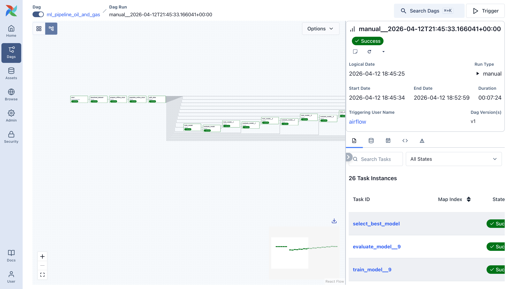
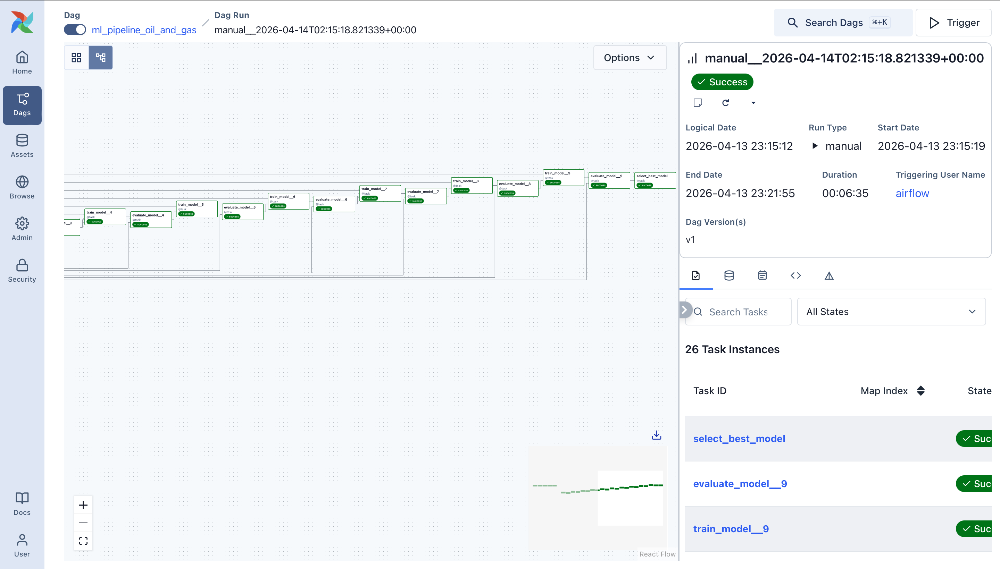
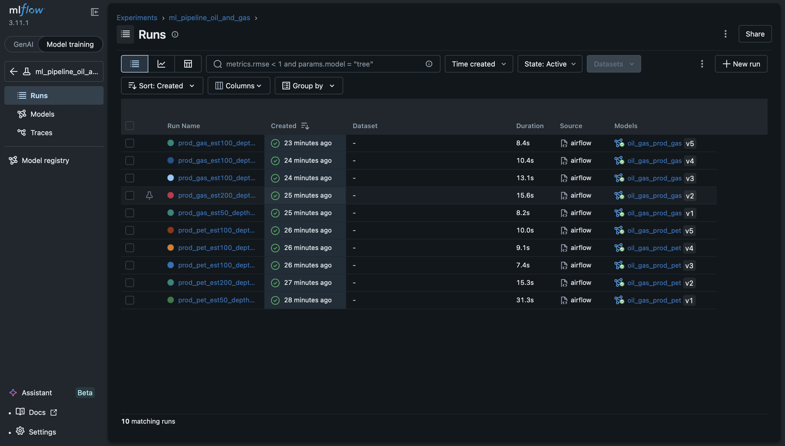
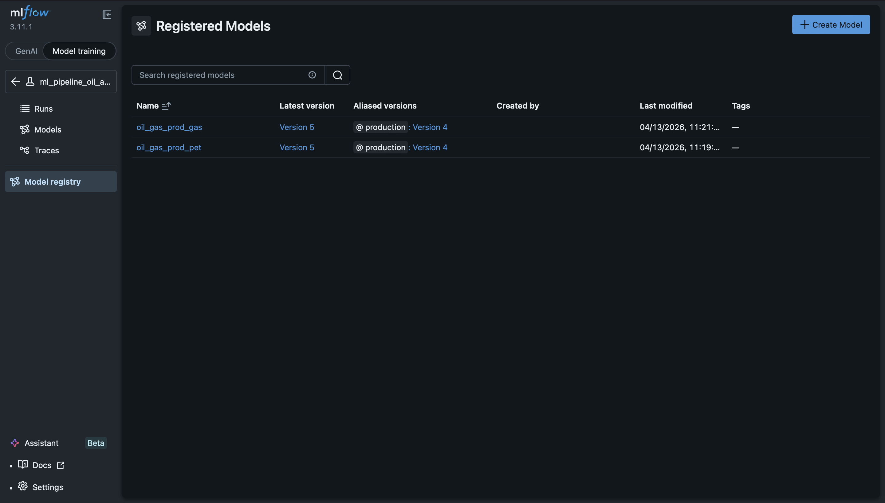
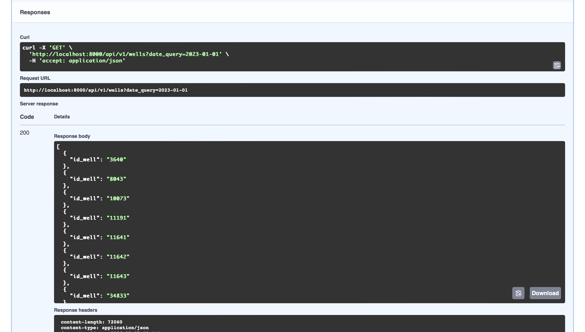
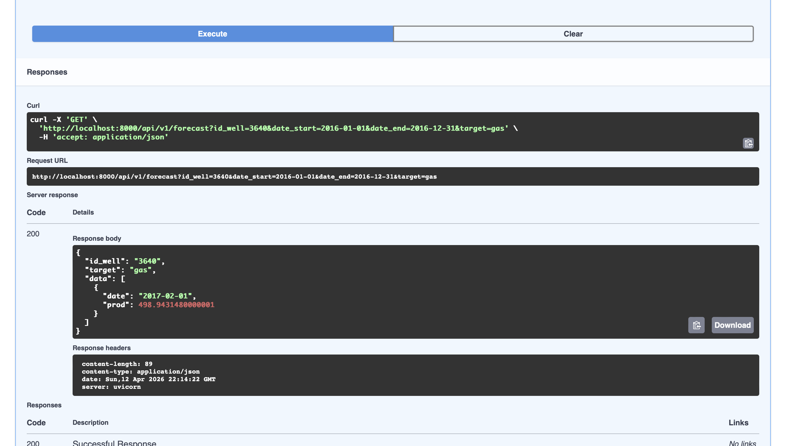
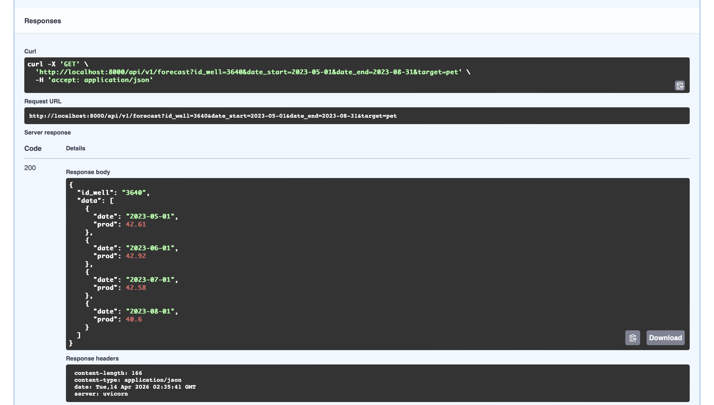

# TP Inteligencia Artificial En Producción - Pipeline De Pronóstico De Producción De Hidrocarburos

## Descripción

Este proyecto implementa un pipeline completo de Machine Learning en producción para pronosticar la **producción mensual de gas y petróleo por pozo** en yacimientos no convencionales (Vaca Muerta, Argentina). El sistema integra Airflow para orquestación, MLFlow para tracking de experimentos, Feast como feature store, y una API REST para consumo externo.

### Objetivo

Dado el historial de producción de un pozo, predecir cuántos m³ de gas o petróleo producirá ese pozo en un mes dado. El sistema entrena y actualiza los modelos mensualmente de forma automática, expone las predicciones a través de una API REST, y mantiene trazabilidad completa de experimentos y versiones de modelo.

### Datos

El RFC especifica dos datasets del [Ministerio de Energía de Argentina](http://datos.energia.gob.ar):

- **Dataset 1 — Producción por pozo** en uso: lecturas mensuales de producción de gas, petróleo y agua por pozo no convencional.
- **Dataset 2 — Listado de pozos** pendiente de integración: metadata extra por pozo (empresa operadora, formación geológica, cuenca, coordenadas) que no está disponible en el Dataset 1. Su integración mejoraría la capacidad predictiva del modelo, pero queda fuera del scope de este trabajo: el foco está en la arquitectura MLOps que mantiene el modelo productivo, no en optimizar el modelo en sí.

Las variables principales del Dataset 1 son:

| Variable | Tipo | Rol |
|---|---|---|
| `prod_gas` | Numérica (m³/mes) | **Target** — producción de gas |
| `prod_pet` | Numérica (m³/mes) | **Target** — producción de petróleo |
| `tipoextraccion` | Categórica | Feature — tipo de extracción (ej: shale, tight) |
| `profundidad` | Numérica (m) | Feature — profundidad del pozo |
| `tef` | Numérica (días) | Feature — tiempo efectivo de flujo en el mes |
| `prod_agua` | Numérica (m³/mes) | Feature — producción de agua asociada |
| `avg_prod_gas_10m` | Numérica | Feature calculado — promedio de producción de gas de los últimos 10 meses |
| `avg_prod_pet_10m` | Numérica | Feature calculado — ídem para petróleo |
| `last_prod_gas` | Numérica | Feature calculado — última producción de gas conocida |
| `last_prod_pet` | Numérica | Feature calculado — ídem para petróleo |
| `n_readings` | Entera | Feature calculado — cantidad de lecturas acumuladas del pozo (proxy de madurez) |

Se recomienda filtrar el dataset a partir de 2021 pasando `date_from=` al triggerear el DAG, para excluir la distorsión de COVID-19 (2020) y la heterogeneidad tecnológica de pozos anteriores a la maduración de Vaca Muerta. El filtro no es automático — ver [Cómo reproducir el entrenamiento](#cómo-reproducir-el-entrenamiento) para los rangos recomendados según el entorno.

### Modelo y métricas

Se entrenan dos modelos independientes (`prod_gas` y `prod_pet`) usando **RandomForestRegressor**. Se evalúan 10 experimentos en total (5 por target) variando `n_estimators`, `max_depth` y el conjunto de features. El modelo con mejor R² es promovido automáticamente a producción en MLFlow.

Las métricas de evaluación son **R²**, **RMSE** y **MAE** sobre un test set temporal (20% de fechas más recientes).

---

## Índice

- [Arquitectura](#arquitectura)
- [Posicionamiento MLOps](#posicionamiento-mlops)
- [Screenshots](#screenshots)
- [Setup](#setup)
- [Cómo reproducir el entrenamiento](#cómo-reproducir-el-entrenamiento)
- [Decisiones de Diseño](#decisiones-de-diseño)
- [Feature Store](#feature-store)
- [Features del Modelo](#features-del-modelo)
- [DAG: `ml_pipeline_oil_and_gas`](#dag-ml_pipeline_oil_and_gas)
- [Relación entre el entrenamiento y la API](#relación-entre-el-entrenamiento-y-la-api)
- [API REST](#api-rest)

---

## Arquitectura

```
Dataset (CSV)
    ↓
Airflow DAG
    ├── download_dataset        → descarga el CSV
    ├── prepare_offline_store   → calcula features y genera el parquet + feast apply
    ├── populate_online_store   → materializa features recientes al SQLite
    ├── split_data              → obtiene features del feature store y splitea
    ├── train_model (x N)       → entrena experimentos en serie
    ├── evaluate_model (x N)    → evalúa y loguea en MLFlow
    └── select_best_model       → promueve el mejor modelo a producción

Feature Store (Feast)
    ├── Offline Store (parquet) → features históricos para entrenamiento
    └── Online Store (SQLite)   → features más recientes para inferencia

MLFlow
    ├── Experiment tracking     → métricas y artefactos por experimento
    └── Model Registry          → versiones y alias de producción

API REST (FastAPI)
    ├── GET /api/v1/forecast    → pronóstico de producción de un pozo (gas o petróleo)
    └── GET /api/v1/wells       → listado de pozos disponibles
```

---

## Posicionamiento MLOps

### Arquitectura FTI

El proyecto implementa el patrón **Feature → Training → Inference (FTI)**, que separa el sistema en tres pipelines con responsabilidades distintas:

| Pipeline | Responsabilidad | Implementación en este proyecto |
|---|---|---|
| **Feature Pipeline** | Ingerir, transformar y almacenar features | Tareas `download_dataset` + `prepare_offline_store` + `populate_online_store` del DAG |
| **Training Pipeline** | Leer features históricos, entrenar y guardar el modelo | Tareas `split_data` + `train_model` + `evaluate_model` + `select_best_model` del DAG |
| **Inference Pipeline** | Usar el modelo y features en tiempo real para predecir | API REST (FastAPI) + online store (SQLite) |

En este proyecto los tres pipelines están implementados dentro de un único DAG de Airflow, lo que simplifica la orquestación pero los acopla al mismo schedule. En un sistema más maduro cada pipeline correría como un DAG independiente — por ejemplo, el Feature Pipeline podría correr diariamente mientras el Training Pipeline corre mensualmente.

El Feature Store es el contrato entre los tres pipelines: garantiza que training e inference lean exactamente las mismas features con la misma lógica de transformación, eliminando el **training-serving skew** — el problema que ocurre cuando el modelo se entrena con features calculados de una forma pero en producción se calculan de otra, generando predicciones sesgadas aunque el modelo en sí sea correcto.

### Nivel de madurez

Este proyecto implementa **Nivel 1 de MLOps (Continuous Training)** según la clasificación de Google:

| Característica | Nivel 0: Manual | Nivel 1: CT | Nivel 2: CI/CD | Este proyecto |
|---|---|---|---|---|
| Construcción del modelo | Manual (notebooks) | Automatizada | Automatizada | **Automatizada** (DAG en Airflow) |
| Entrenamiento | Manual | Automatizado (CT) | Automatizado (CT) | **Automatizado** (schedule mensual) |
| Feature Store | No | Sí | Sí | **Sí** (Feast con offline + online store) |
| Gestión de metadatos | No | Sí | Sí | **Sí** (MLFlow Model Registry) |
| Despliegue | Manual | Manual/Scripts | Automatizado | **Manual** (API levantada con Docker) |
| CI/CD | No | No | Integración total | **No** |
| Monitoreo | No | Métricas básicas | Métricas de sistema y modelo | **Parcial** (métricas de entrenamiento en MLFlow) |

Para alcanzar **Nivel 2** se necesitaría agregar: tests automáticos por cada commit, canary o blue-green deployment, y monitoreo activo en producción (prediction bias, feature distribution shift).

### Deuda técnica identificada

| Pregunta | Estado |
|---|---|
| ¿Puedo describir qué features usa este modelo sin leer el código? | ✅ Features documentadas en `features.py` y en este README |
| ¿Puedo reentrenar con un solo comando? | ✅ Un trigger desde la UI de Airflow corre el pipeline completo |
| ¿Cuántos lenguajes distintos necesito para el pipeline? | ✅ Python únicamente |
| ¿Hay tests para los datos de entrada? | ❌ No hay validación de schema del CSV descargado |
| ¿El LabelEncoder se versiona junto al modelo? | ❌ Se re-entrena en cada corrida pero no se persiste en MLFlow como artefacto |
| ¿Hay monitoreo de drift en producción? | ❌ No hay detección automática de prediction bias ni feature distribution shift |
| ¿Los datos están versionados? | ❌ El CSV se descarga sin hashear — si el gobierno actualiza datos históricos, no hay forma de detectarlo |

**Deuda de artefactos:** El `LabelEncoder` de `tipoextraccion` se re-entrena en cada corrida dentro de `prepare_offline_store` pero no se guarda como artefacto en MLFlow junto al modelo. Es una transformación *model-dependent* que debería persistirse. Si el CSV upstream incorpora nuevas categorías de extracción entre una corrida y la siguiente, el mapeo puede cambiar, generando training-serving skew latente.

**Deuda de monitoreo:** No hay detección automática de prediction bias ni feature distribution shift. El pipeline detectaría degradación del modelo solo al comparar el R² del próximo reentrenamiento mensual contra versiones anteriores en MLFlow.

### Reproducibilidad

| Pilar | Estado | Detalle |
|---|---|---|
| **Código** | ✅ | Pipeline definido como código Python en Git, versionado en Airflow como DAG |
| **Datos** | ❌ | CSV descargado de URL pública sin hashear ni versionar |
| **Entorno** | ✅ | Docker Compose con dependencias pineadas; `uvicorn==0.40.0` y `feast==0.47.0` pineados explícitamente |

El gap de datos implica que la linaje de datos es parcial: MLFlow registra parámetros y métricas de cada run, pero no hay un hash del CSV asociado a cada versión del modelo. El punto de extensión natural para cerrar esta brecha es la tarea `download_dataset`.

---

## Screenshots

### DAG corriendo exitosamente (26 tasks, todo verde)



### MLflow - Experimentos y Runs


### MLflow - Model Registry con alias production


### API REST - Endpoint `/api/v1/wells`

El endpoint devuelve los pozos disponibles para una fecha dentro del período de entrenamiento. Los pozos disponibles dependen del parquet generado por el DAG.



### API REST - Endpoint `/api/v1/forecast` — fechas futuras

El DAG fue entrenado con datos de 2023. Al pedir predicción para los 3 meses siguientes (2024), el modelo usa los features del online store y devuelve la misma predicción para cada mes — comportamiento esperado para un modelo single-step sin actualización autoregresiva.



### API REST - Endpoint `/api/v1/forecast` — fechas históricas

Al pedir predicción para 4 meses dentro del período de entrenamiento (2023), el modelo usa los features reales de cada mes desde el parquet. Cada mes tiene su propio `avg_prod_gas_10m` calculado con producción real, por lo que los valores predichos varían.



---

## Setup

### 1. Requisitos

- Docker y Docker Compose
- Python 3.9+

### 2. `.gitignore` recomendado

Este repositorio solo versiona el código fuente (`.py`, `.yaml`, `.yml`, `.md`) necesario para entender y reproducir el proyecto. Las carpetas generadas automáticamente al correr el DAG no se suben al repo ya que pueden pesar varios GBs y se regeneran solas con un solo `docker compose up`.

```
mlruns/
feature_store/data/
feature_store/registry/
feature_store/online_store/
logs/
__pycache__/
*.pyc
.env
```

### 3. Dependencias (`.env`)

```
AIRFLOW_UID=501
_PIP_ADDITIONAL_REQUIREMENTS=pandas scikit-learn mlflow feast fastapi uvicorn==0.40.0
```

> **Nota:** `uvicorn==0.40.0` está pineado para evitar un conflicto de dependencias entre `feast` y `apache-airflow-core 3.1.7`. `feast==0.47.0` está pineado en el contenedor de la API para que coincida con la versión del worker de Airflow — versiones distintas de Feast son incompatibles en la serialización del online store.

### 4. Volúmenes en `docker-compose.yaml`

Todos los servicios corren dentro de contenedores Docker. Para que los archivos persistan en disco y los contenedores puedan acceder a ellos, se montan los siguientes volúmenes:

```yaml
volumes:
  - ./dags:/opt/airflow/dags
  - ./logs:/opt/airflow/logs
  - ./config:/opt/airflow/config
  - ./plugins:/opt/airflow/plugins
  - ./mlruns:/mlflow/mlruns
  - ./feature_store:/opt/airflow/feature_store
```

Esto hace que cada carpeta local sea visible dentro del contenedor en `/opt/airflow/...`. Por eso todos los paths en el código usan `/opt/airflow/...` y no `./`.

### 5. Estructura de carpetas

```
oil_and_gas_mlops_pipeline/
├── dags/
│   └── dag_oil_and_gas.py          ← DAG principal
├── feature_store/
│   ├── data/                       ← parquet con features históricos (generado, no se sube)
│   ├── registry/                   ← metadata de Feast (generado, no se sube)
│   ├── online_store/               ← features recientes en SQLite (generado, no se sube)
│   ├── feature_store.yaml          ← configuración de Feast
│   └── features.py                 ← definición de entidades y feature views
├── api/
│   └── main.py                     ← API REST con FastAPI
├── screenshots/                    ← capturas de pantalla del sistema funcionando
├── mlruns/                         ← artefactos de MLFlow (generado, no se sube)
├── logs/                           ← logs de Airflow (generado, no se sube)
├── plugins/
├── config/
├── .env                            ← variables de entorno (no se sube al repo)
├── .gitignore
└── docker-compose.yaml
```

### 6. `feature_store.yaml`

```yaml
project: oil_gas_production
registry: /opt/airflow/feature_store/registry/registry.db
provider: local
offline_store:
  type: file
online_store:
  type: sqlite
  path: /opt/airflow/feature_store/online_store/online.db
```

- **registry**: Feast guarda aquí la metadata (qué features existen, qué esquema tienen, dónde está el parquet)
- **offline_store**: archivo parquet con toda la historia de features por pozo y por mes
- **online_store**: base de datos SQLite con la última fila de cada pozo, lista para inferencia instantánea

### 7. Cómo levantar el sistema

```bash
docker compose up -d
```

El sistema tarda aproximadamente 2-3 minutos en estar completamente operativo.

### 8. Acceso a los servicios

| Servicio | URL | Credenciales |
|----------|-----|--------------|
| Airflow UI | http://localhost:8080 | airflow / airflow |
| MLFlow UI | http://localhost:9090 | - |
| API Swagger | http://localhost:8000/docs | - |

### 9. Nota sobre MLFlow y seguridad de red

MLFlow 3.5+ incluye un middleware de seguridad que por defecto solo acepta conexiones desde localhost. Para permitir conexiones entre contenedores Docker es necesario deshabilitar este middleware con la variable de entorno `MLFLOW_SERVER_DISABLE_SECURITY_MIDDLEWARE=true` y arrancar el servidor con `--host 0.0.0.0`. Esto está configurado en el `docker-compose.yaml`.

---

## Cómo reproducir el entrenamiento

Desde la UI de Airflow en http://localhost:8080, triggerear el DAG `ml_pipeline_oil_and_gas` con los parámetros:

- `date_from`: fecha de inicio del rango de entrenamiento (formato `YYYY-MM-DD`)
- `date_to`: fecha de fin del rango de entrenamiento (formato `YYYY-MM-DD`)

El DAG puede correr con el dataset completo (sin especificar fechas), pero se recomienda acotar el rango según la memoria disponible. `get_historical_features` de Feast carga el parquet en memoria para el point-in-time join — con recursos limitados el DAG puede fallar con OOM.

| Contexto | Rango | Motivo |
|---|---|---|
| **Entorno local** (laptop con 9 contenedores) | `2023-01-01` / `2023-12-31` | Con ~1.5-2GB libres disponibles, un año de datos es lo que entra sin OOM |
| **Producción** | `2021-01-01` / hasta la fecha más reciente | Con más memoria o backend distribuido (BigQuery, Spark), Feast puede manejar el dataset completo |

**Por qué 2021 como inicio:** 2020 fue atípico por COVID-19. A partir de 2021 Vaca Muerta retomó crecimiento sostenido. Además, las técnicas de completación cambiaron radicalmente entre 2012 y 2021 (de 1.500 a 2.500 lb de proppant por pie), por lo que datos anteriores representan una realidad operativa distinta que introduce ruido.

**Importante:** el rango de fechas elegido condiciona el comportamiento posterior de la API. Ver [Relación entre el entrenamiento y la API](#relación-entre-el-entrenamiento-y-la-api).

---

## Decisiones de diseño

### 1. Supuesto: los datos históricos del gobierno no se modifican retroactivamente

El pipeline no hashea ni versiona el CSV descargado. El supuesto es que los datos históricos publicados por el Ministerio de Energía son inmutables una vez publicados. Si el gobierno corrigiera datos históricos entre dos corridas, no habría forma de detectarlo. Se aceptó el supuesto porque agregar hashing introduce complejidad no justificada mientras el supuesto se mantenga válido.

### 2. Orden del filtro de fechas en `prepare_offline_store`

El filtro se aplica **después** de calcular los features de ventana. Si se filtrara primero, el `avg_prod_gas_10m` de la primera fila del rango solo tendría contexto desde `date_from`, perdiendo todo el historial anterior. El orden correcto garantiza que el rolling usa el dataset completo antes de recortar.

### 3. Split temporal en lugar de split aleatorio

Para series de tiempo, un split aleatorio introduce data leakage: el modelo podría entrenarse con datos de 2023 para predecir datos anteriores. El split temporal garantiza que el modelo solo ve el pasado durante el entrenamiento (80% fechas más antiguas = train, 20% más recientes = test).

### 4. `get_historical_features` de Feast para el entrenamiento

El entrenamiento consume del feature store vía `get_historical_features`, que hace un point-in-time lookup: para cada par `(idpozo, fecha)` devuelve los features tal como eran en esa fecha, evitando data leakage entre períodos. El online store (SQLite) se usa para inferencia.

### 5. Dos modelos independientes: `prod_gas` y `prod_pet`

En pozos no convencionales, la producción de gas y petróleo no siempre están correlacionadas — un pozo puede ser predominantemente gasífero o petrolífero según la formación geológica. Mezclar features de un fluido para predecir el otro introduciría ruido. Cada modelo tiene sus propios features de ventana, sus experimentos y su alias `production` en MLFlow.

### 6. Alias `production` en lugar de stages en MLFlow

`transition_model_version_stage` está deprecado en versiones recientes de MLFlow. El alias `"production"` es el mecanismo recomendado. Si el DAG vuelve a correr y encuentra un modelo mejor, el alias se mueve automáticamente — la API siempre sirve el mejor modelo sin cambiar el código.

### 7. `select_best_model` compara solo versiones del run actual

`select_best_model` filtra por los `run_id` generados en el DAG actual, en lugar de comparar todas las versiones históricas acumuladas en MLFlow. Las métricas no son comparables entre runs entrenados con datasets distintos: un R² calculado sobre el test set del run A (entrenado con dataset completo) y un R² del run B (entrenado con 2023 únicamente) se evalúan sobre distribuciones distintas.

### 8. Predicción autoregresiva descartada en la API

Para fechas futuras la API repite la misma predicción en lugar de actualizar `avg_prod_10m` con valores predichos. Alimentar el modelo con sus propias predicciones cambiaría la distribución del feature respecto al entrenamiento (distribution shift). En pozos shale con decline pronunciado, el error se autocorrelacionaría.

---

## Feature Store

### ¿Por qué un Feature Store?

Cuando el modelo necesita predecir la producción de un pozo, requiere features como el promedio de producción de los últimos 10 meses. Calcularlo en el momento de cada inferencia sería lento y costoso. El feature store resuelve esto separando el problema en dos partes:

- **Offline Store**: almacena los features históricos de todos los pozos en todos los períodos. Se usa para entrenamiento. Internamente es un archivo parquet (`well_features.parquet`).
- **Online Store**: almacena solo el estado más reciente de cada pozo. Se usa para inferencia. Internamente es una base de datos SQLite (`online.db`).

### Offline Store vs Online Store

**Offline Store** (una fila por pozo por mes, toda la historia):

| idpozo | fecha | avg_prod_gas_10m | last_prod_gas | n_readings |
|--------|-------|-----------------|---------------|------------|
| 132879 | 2020-01 | 430.2 | 445.0 | 5 |
| 132879 | 2020-02 | 438.5 | 460.1 | 6 |
| 132879 | 2020-03 | 441.0 | 455.3 | 7 |

**Online Store** (una sola fila por pozo, lo más reciente):

| idpozo | avg_prod_gas_10m | last_prod_gas | n_readings |
|--------|-----------------|---------------|------------|
| 132879 | 441.0 | 455.3 | 48 |

### ¿Por qué el online store está en SQLite y no en el parquet?

El parquet puede tener millones de filas. Leerlo completo en cada request de inferencia sería inviable. El online store resuelve esto copiando solo la última fila de cada pozo al SQLite. Cuando la API necesita los features de un pozo, hace un lookup por clave primaria (`idpozo`) en O(1).

En resumen: el offline store *calcula* los features, el online store los *sirve rápido*.

### Materialización

Es el proceso de copiar los features más recientes del offline store al online store. Se ejecuta una vez por mes junto con el reentrenamiento. En Feast se hace con `write_to_online_store`.

### `features.py`

Define el contrato de features que Feast espera encontrar en el parquet. Tiene tres componentes:

- **Entity**: el "sujeto" de los features. En este caso el pozo (`idpozo`).
- **FileSource**: le dice a Feast dónde está el parquet y qué columna usar como timestamp para el point-in-time lookup.
- **FeatureView**: une la entidad con la fuente y define el esquema (nombre y tipo de cada feature). Los nombres tienen que coincidir exactamente con las columnas del parquet.

---

## Features del Modelo

### Dataset original

- `idpozo`: identificador único del pozo
- `anio` y `mes`: año y mes de la lectura (se combinan en `fecha`)
- `prod_gas`: producción de gas (target)
- `prod_pet`: producción de petróleo (target)
- `prod_agua`: producción de agua (feature)
- `tef`: tiempo efectivo de flujo (feature)
- `profundidad`: profundidad del pozo (feature)
- `tipoextraccion`: tipo de extracción, variable categórica encodada con LabelEncoder (feature)

### Features calculados

| Feature | Descripción | Justificación |
|---------|-------------|---------------|
| `avg_prod_gas_10m` | Promedio de prod_gas de las últimas 10 lecturas | Captura la tendencia reciente del pozo |
| `avg_prod_pet_10m` | Promedio de prod_pet de las últimas 10 lecturas | Ídem para petróleo |
| `last_prod_gas` | Última producción de gas conocida | Punto de partida para la predicción |
| `last_prod_pet` | Última producción de petróleo conocida | Ídem para petróleo |
| `n_readings` | Cantidad de lecturas acumuladas del pozo | Indica madurez del pozo: un pozo nuevo tiene features menos confiables |

### ¿Por qué `shift(1)`?

Todos los features de ventana se calculan con `shift(1)`, que desplaza los valores un período hacia adelante. Esto evita **data leakage**: cuando el modelo está parado en marzo 2020, solo puede ver datos hasta febrero 2020.

```python
df['avg_prod_gas_10m'] = df.groupby('idpozo')['prod_gas'].transform(
    lambda x: x.shift(1).rolling(10, min_periods=1).mean()
)
```

### Fila futura para el online store

Para cada pozo, se genera una fila extra con fecha del próximo mes y sin target (`prod_gas = None`, `prod_pet = None`). Esta fila es la que se materializa en el online store y representa el estado actual del pozo listo para inferencia.

---

## DAG: `ml_pipeline_oil_and_gas`

El DAG corre automáticamente el **primer día de cada mes** (`schedule="0 0 1 * *"`), alineado con la frecuencia natural del dataset. También se puede triggerear manualmente con parámetros opcionales `date_from` y `date_to`.

### Flujo de tasks

```
start
  ↓
download_dataset
  ↓
prepare_offline_store
  ↓
populate_online_store
  ↓
split_data
  ↓
train_model → evaluate_model (x10 experimentos, en serie)
  ↓
select_best_model
```

### Task 1: `download_dataset`

Descarga el CSV completo desde la URL del gobierno y lo guarda en `/opt/airflow/data/pozos.csv`. Se descarga completo cada vez para asegurar que los datos estén actualizados. El filtro por fechas se aplica después en `prepare_offline_store`.

### Task 2: `prepare_offline_store`

Lee el CSV, aplica todas las transformaciones y genera el parquet del offline store. Transformaciones en orden:

1. Construye `fecha` a partir de `anio` y `mes`
2. Selecciona columnas relevantes y dropea nulos
3. Encodea `tipoextraccion` con `LabelEncoder`
4. Calcula features de ventana sobre el **dataset completo** (`groupby + rolling + shift`)
5. Aplica el filtro de fechas (`date_from` / `date_to`) después de los features
6. Genera la fila futura por pozo para el online store
7. Borra el registry y el SQLite antes de `feast apply` para garantizar consistencia
8. Guarda el parquet y ejecuta `feast apply`

### Task 3: `populate_online_store`

Lee el parquet, se queda con la última fila de cada pozo (la fila futura sin target) y la escribe en el SQLite via `write_to_online_store`. Siempre tiene exactamente una fila por pozo.

### Task 4: `split_data`

Obtiene los features históricos del offline store via Feast usando `get_historical_features` (point-in-time lookup). Descarta las filas futuras y divide en train/test con split temporal: 80% fechas más antiguas como train, 20% más recientes como test.

El split se hace acá y no en `train_model` para que todos los experimentos se evalúen sobre el mismo conjunto de test.

### Tasks 5 y 6: `train_model` y `evaluate_model`

Entrena **dos modelos independientes**: uno para `prod_gas` y otro para `prod_pet`. El loop recorre 10 experimentos en total (5 por target), variando `n_estimators`, `max_depth` y el conjunto de features.

| # | Target | `n_estimators` | `max_depth` | Features |
|---|---|---|---|---|
| 1 | `prod_pet` | 50 | sin límite | todas (7) |
| 2 | `prod_pet` | 100 | sin límite | todas (7) |
| 3 | `prod_pet` | 100 | 5 | todas (7) |
| 4 | `prod_pet` | 100 | 10 | todas (7) |
| 5 | `prod_pet` | 100 | sin límite | reducidas (3) |
| 6 | `prod_gas` | 50 | sin límite | todas (7) |
| 7 | `prod_gas` | 100 | sin límite | todas (7) |
| 8 | `prod_gas` | 100 | 5 | todas (7) |
| 9 | `prod_gas` | 100 | 10 | todas (7) |
| 10 | `prod_gas` | 100 | sin límite | reducidas (3) |

El experimento con features reducidas (`tipoextraccion`, `tef`, `profundidad`) sirve como baseline de ablación: verifica si el modelo colapsa sin los features de ventana temporal.

`evaluate_model` loguea en MLFlow las métricas `mae`, `mse`, `rmse` y `r2`, y registra el modelo en el Model Registry bajo `oil_gas_prod_gas` u `oil_gas_prod_pet`. También agrega tags y descripción a cada versión para que el Model Registry sea legible sin necesidad de abrir cada run.

### Task 7: `select_best_model`

Recibe los `run_id` de los experimentos del DAG actual, filtra las versiones del Model Registry por esos IDs, y promueve la de mejor R² con el alias `"production"`:

- `oil_gas_prod_gas@production` → mejor modelo para gas
- `oil_gas_prod_pet@production` → mejor modelo para petróleo

---

## Relación entre el entrenamiento y la API

El rango de fechas elegido al triggerear el DAG condiciona directamente el comportamiento de la API. Cuando el DAG corre con `date_from=2023-01-01` y `date_to=2023-12-31`:

- El **parquet** contiene features históricos para todos los pozos entre enero y diciembre de 2023, más una fila futura por pozo (enero 2024) con `prod_gas = None`.
- El **online store** queda con los features del estado más reciente de cada pozo — los correspondientes a diciembre 2023.
- El **modelo** fue entrenado con datos de 2023.

| Fecha pedida | Fuente de features | Comportamiento |
|---|---|---|
| Anterior al período de entrenamiento | — | Error HTTP 400 (no permitido) |
| Dentro del período de entrenamiento | Offline store (parquet) | Predicción distinta por mes usando features reales |
| Posterior al período de entrenamiento | Online store (SQLite) | Misma predicción para todos los meses del rango |

Para fechas futuras el modelo usa siempre los mismos features (estado de diciembre 2023) y devuelve la misma predicción para todos los meses — es una limitación del modelo single-step documentada en la decisión de diseño #8.

---

## API REST

### `GET /api/v1/forecast`

**Parámetros:**

| Parámetro | Tipo | Requerido | Descripción |
|-----------|------|-----------|-------------|
| `id_well` | string | SI | Identificador del pozo |
| `date_start` | string (YYYY-MM-DD) | SI | Fecha de inicio del rango |
| `date_end` | string (YYYY-MM-DD) | SI | Fecha de fin del rango |
| `target` | string | NO | `"gas"` (default) o `"pet"` |

**Funcionamiento:** genera el rango mensual entre `date_start` y `date_end` y para cada mes decide la fuente de features según la tabla de la sección anterior. Devuelve un punto por cada mes del rango.

**Ejemplo de respuesta — 3 meses futuros:**
```json
{
  "id_well": "3640",
  "data": [
    { "date": "2024-01-01", "prod": 435.73 },
    { "date": "2024-02-01", "prod": 435.73 },
    { "date": "2024-03-01", "prod": 435.73 }
  ]
}
```

**Limitación conocida:** con un dataset de entrenamiento de un solo año (2023), la capacidad discriminativa del modelo en inferencia futura es limitada. Incorporar el Dataset 2 (metadata extra por pozo) mejoraría la diferenciación entre pozos en inferencia futura.

### `GET /api/v1/wells`

Devuelve el listado de pozos disponibles para una fecha dada (`date_query`). La fecha debe ser el primer día del mes (ej: `2023-01-01`) y debe estar dentro del período de entrenamiento.
